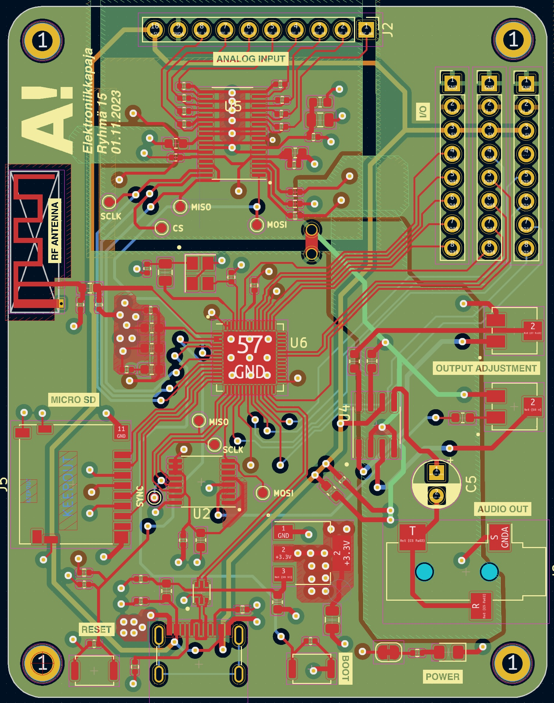

# Suunnattava suuntamikrofoni 

Suunnattava suuntamikrofoni on laite, jolla voidaan elektronisesti ohjata äänityksen suuntaa käännettävän suuntauksen avulla. Laite koostuu kahdesta piirikortista: Ensimmäinen piirikortti sisältää kuuden mikrofonin ryhmän, josta luetaan dataa. Toinen piirikortti hoitaa signaalinkäsittelyn ja laitteen ohjauksen ESP32-S3-mikro-ohjaimeen perustuvalla järjestelmällä.

## Mikrofonipiiri

-   ...

## Signaalinkäsittelypiiri

  
  
  
Kuva 1: ESP32-DSP piirikaavio ja piirikortti

  
  
Kuva 2: ESP32-DSP piirikortti toteutettuna

## TODO
* [x] DSP alustan suunnittelu
* [x] Mikrofoonipiirin suunnittelu
* [x] Piirikorttien kasaus
* [x] Datan keräys ADS8688-ADC:n avulla
* [ ] Beam forming algoritmi
* [ ] Äänen toisto käyttäjälle