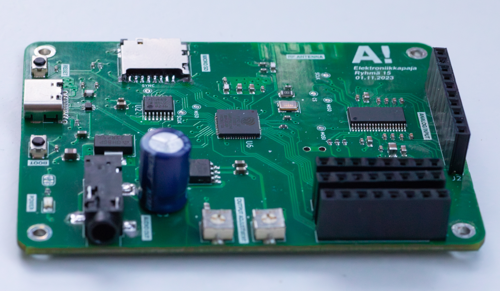

# Suunnattava suuntamikrofoni 

Suunnattava suuntamikrofoni on laite, jolla voidaan elektronisesti ohjata äänityksen suuntaa käännettävän suuntauksen avulla. Laite koostuu kahdesta piirikortista: Ensimmäinen piirikortti sisältää kuuden mikrofonin ryhmän, josta luetaan dataa. Toinen piirikortti hoitaa signaalinkäsittelyn ja laitteen ohjauksen ESP32-S3-mikro-ohjaimen perustuvalla järjestelmällä.

  
   

  

## TODO
* [x] DSP alustan suunnittelu
* [x] Datan keräys ADS8688-ADC:n avulla
* [ ] Beam forming algoritmi
* [x] Mikrofoonipiirin suunnittelu
* [ ] Äänen toisto käyttäjälle